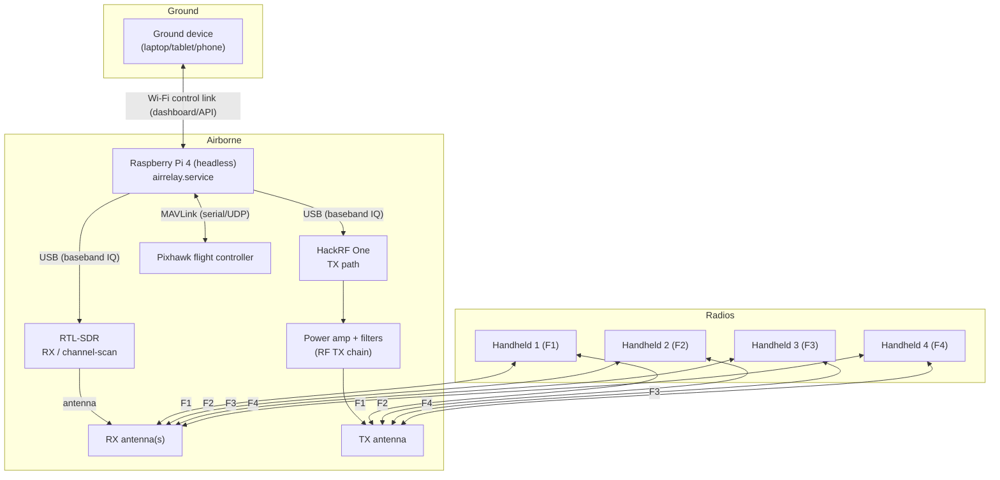
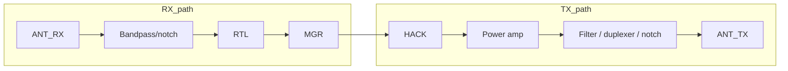
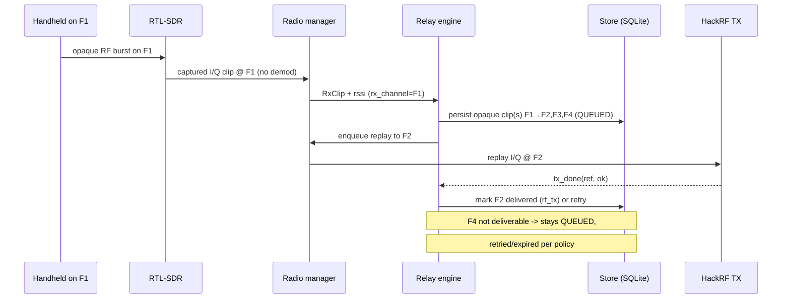
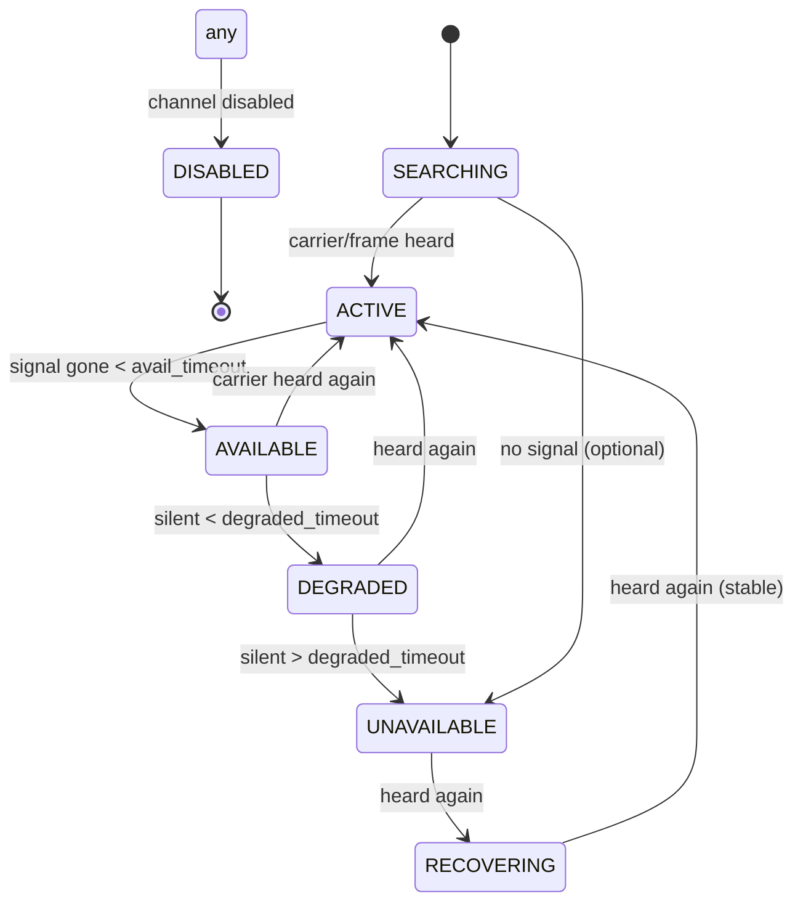
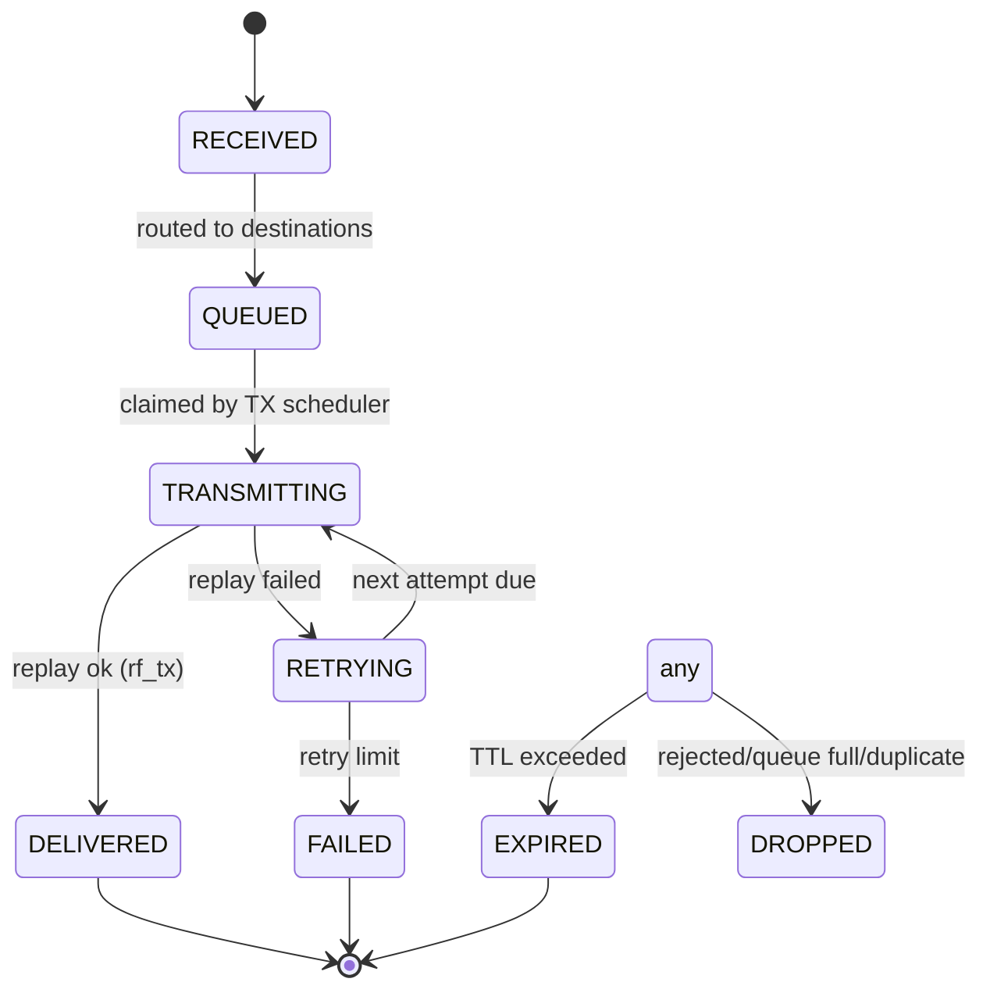
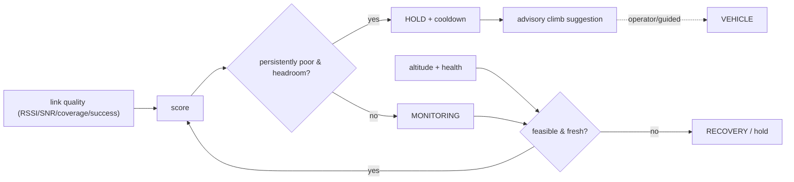
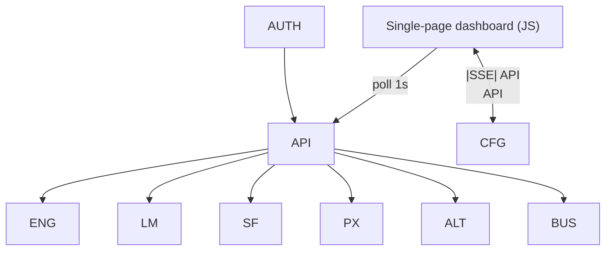

# Architecture

This document describes the complete system. All diagrams are Mermaid and
render on GitHub or any Mermaid-capable viewer.

## 1. System architecture

## 2. Software architecture

```mermaid
flowchart LR
    subgraph Web
        DASH["Browser dashboard"]
        API["Flask REST + SSE API"]
        AUTH["Auth"]
    end
    subgraph Core
        BUS["Event bus"]
        CFG["Config manager (persistent)"]
        LOG["Structured logger"]
    end
    subgraph Relay
        ENG["Relay engine"]
        LM["Link monitor"]
        SF["Store-and-forward (SQLite)"]
    end
    subgraph Radio
        MGR["Radio manager (time-division scheduler)"]
        CAP["Squelch-gated I/Q capture (no demod)"]
        SDRAB["SDR abstraction"]
        RTL["RTL-SDR backend"]
        HACK["HackRF backend"]
    end
    subgraph Flight
        PX["Pixhawk interface"]
        ALT["Altitude optimizer"]
    end

    DASH --> API --> AUTH
    API --> CFG
    API --> ENG
    DASH <-- "SSE" --> BUS
    ENG --> BUS
    MGR --> BUS
    PX --> BUS
    CFG --> ENG
    CFG --> MGR
    CFG --> LM
    ENG --> SF
    ENG --> LM
    MGR --> LM
    ENG --> MGR
    MGR --> CAP --> SDRAB
    SDRAB --> RTL
    SDRAB --> HACK
    PX --> PIX
    ALT --> LM
    ALT --> PX
```

The web server, radio manager, relay engine, store and (optionally) Pixhawk
interface run in **one process** under a single systemd unit. They communicate
via direct calls and the in-process event bus. This keeps service dependency
handling simple while still reporting each component's health independently.

## 3. RF architecture

Key design rules (details in `rf_architecture.md`):

* RTL-SDR only **receives**; HackRF only **transmits** (relay-role).
* RX and TX are **never** simultaneous — the scheduler alternates them so the
  HackRF never desenses the RTL-SDR's current channel.
* Antennas are physically separated; the RX antenna carries a filter that
  rejects the TX band, and TX leakage power is budgeted below RTL desense
  thresholds. Software filtering alone is never relied on to solve RF
  self-interference.

## 4. Data flow (message)

## 5. Link-state machine

`ACTIVE/AVAILABLE/RECOVERING` count as "heard" for relay-mode delivery.

## 6. Message lifecycle

## 7. Altitude optimization loop

## 8. Dashboard architecture

Reads poll `/api/overview` every second; live events stream over Server-Sent
Events (`/api/stream`). Frequency changes go through `PUT /api/config/channels`
which validates, persists, then pushes the new frequency set to the radio
subsystem.
